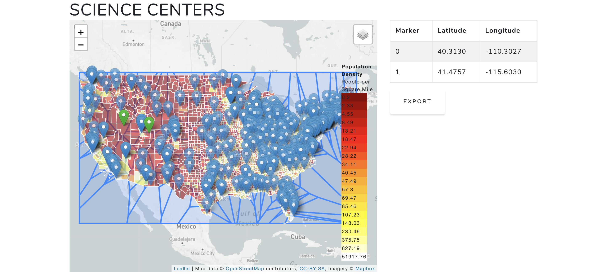

<h1>Science Center Project</h1>

This project combines information from the US Census with API results of science center locations from astc.org, and contrasts them.  The business use for this application is to higlight regions where science centers are not part of the ASTC network, or where additional science centers warrant being built.  

The core functionality lies within Web_Page folder where you will be able to launch the website, which is accessible here: http://sciencecentersapp-env.nq2tykwyxd.us-east-1.elasticbeanstalk.com.   

Data munging and cleanup lies within the Data_Cleanup_And_Output folder. This is where the cleaning and retrieval of the Census data lies, as well as the function that was developed to turn both the census data and science center data into geoJSONs.  Modification of both data sets was required to place the data into an appropriate format for geospatial calculations.  Unused data was trimmed out. 

More munging and cleanup for the Student science literacy is available in the Student_Map_Data_Wrangling folder. The function for transforming this data into a geoJSON is the same function used previously.   

The web scraping to retrieve all of the science center data is within the Webscraper folder.   

Finally, the materials used to present this information to a panel exists in the Presentation folder.
